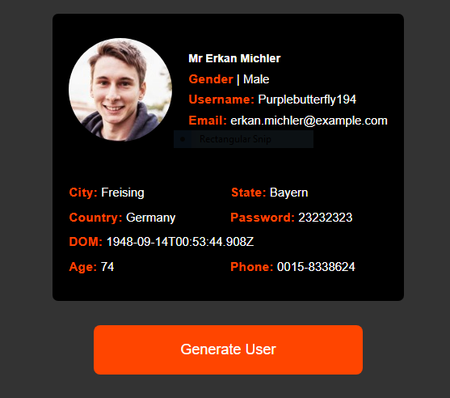

# Random User Generator

> A simple App to generate random users while consuming **[randomuser API](https://randomuser.me/documentation)**

### See the Project Screenshot



### To open the project in your browser run:

```
npm start
```

This will open the project in port 8080
